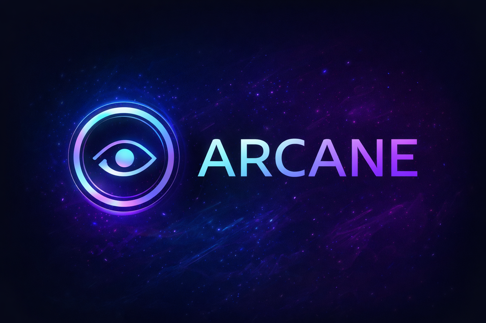

<p align="center">
  
</p>

<h1 align="center">Arcane Panel</h1>

<p align="center">
  Un panel d’admin self-hosted pour gérer tes machines, checks, alertes et jobs — version V1 (Django + Celery).
</p>

<p align="center">
  <!-- "Latest Release / Pre-Release" style comme ton screen -->
  
  
</p>

<p align="center">
  <!-- Badges perso / branding -->
  
  
  
  
</p>

<p align="center">
  <!-- Stack -->
  
  
  
  
  
</p>

<p align="center">
  <!-- Repo badges -->
  
  
  
  
</p>

---

## 🧠 C’est quoi Arcane Panel ?

**Arcane Panel** est une V1 prête à lancer qui te donne un cockpit unique :
- inventaire (assets),
- supervision (checks + historique),
- alerting (open/close),
- socle “jobs” (actions à exécuter plus tard via agent ou APIs).

Le but : une base solide, simple, extensible, avant d’ajouter **Proxmox / PBS / agents**, etc.

---

## ✨ Features (V1)

### ✅ Assets
- inventaire machines (VM / serveur / NAS / réseau / autre)
- tags (ex: `pve,prod,site-a`)
- activation/désactivation

### ✅ Monitoring (checks)
- `ping` (ICMP)
- `tcp_port` (ex: 22/80/443)
- `http/https` (status attendu configurable)
- `ssl_expiry` (alerte si expiration proche)

### ✅ Alerts
- alertes automatiques à l’échec
- fermeture automatique au retour OK
- historique + détails (asset, type, message)

### ✅ Jobs (socle)
- modèle Job + logs
- prêt pour : restart service / proxmox start/stop / PBS backup trigger / etc.

### ✅ Asynchrone
- Celery Worker (exécution)
- Celery Beat (scheduler)

---

## 📦 Tech stack

- **Backend** : Django 5 + DRF (prêt pour APIs)
- **DB** : PostgreSQL
- **Queue** : Redis
- **Workers** : Celery + Beat
- **Run** : Docker Compose

---

## 🚀 Installation (Debian/Ubuntu)

### 1) Récupérer le projet
```bash
git clone https://github.com/OWNER/REPO.git arcane-panel
cd arcane-panel